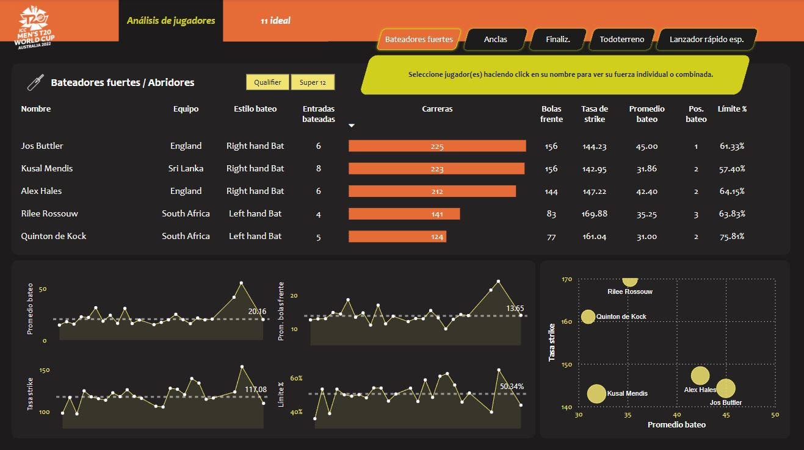
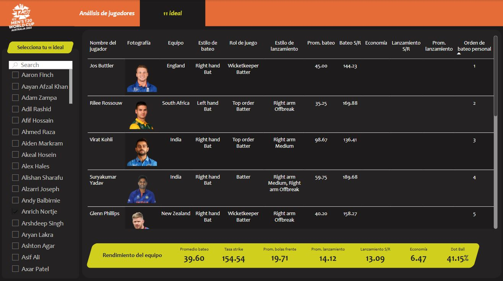

# Ideal Cricket Team Case

📌 Also available in [Spanish](README.es.md) | 📌 Disponible también en [Español](README.es.md)

This dashboard allows the visualization of the most relevant features of players from the 2022 Cricket World Cup to select the top 11.  
The visualizations enable detailed analysis by player, showing both individual and team performance.





## Objective:

To analyze the players with the highest scores in key indicators. Additionally, players must exceed a minimum threshold to be considered for the final team. The selection criteria can be found in the following file: 📄 [View documentation in PDF](./Parameters.pdf). Based on this analysis, the top 11 cricket players are selected.

## Player roles:
```
  • Power Hitter / Openers:       start the match and face the first balls of the game.
  • Anchor:                       more stable batters, control the game pace.
  • Finisher:                     close the innings and can stabilize in critical situations.
  • All-rounder:                  they excel in both batting and bowling.
  • Specialist Fast Bowler:       specialized in speed, key to restricting the opponent.
```

## Key indicators:
```
  • Batting Average:              average number of runs scored per innings by the batter.
  • Strike Rate:                  number of runs scored per 100 balls faced.
  • Innings Batted:               total number of times a player has batted.
  • Balls Faced Average:          average number of balls faced per innings.
  • Boundary %:                   percentage of runs scored through boundaries (4s and 6s).
  • Batting Position:             the position in which the player enters to bat (lower = earlier).
  • Innings Bowled:               total number of innings in which the player has bowled.
  • Economy Rate:                 average number of runs conceded per over (6 balls).
  • Bowling Strike Rate:          average number of balls needed to take a wicket.
  • Bowling Average:              average number of runs conceded per wicket taken.
  • Bowling Style:                bowler's delivery style (Fast, Spin, etc.).
  • Dot Ball %:                   percentage of balls bowled where no runs were conceded.
```

## Repository content:

- `data_preprocessing.ipynb`: data preprocessing in Python
- `dashboard_cricket.pbix`: dashboard developed in Power BI
- `Parameters.pdf`: PDF document with evaluation criteria
- `📁data/csv`: folder containing CSV files (dataset)
- `📁data/json`: folder containing JSON files (dataset)

## Technologies and concepts applied:
  - Python (data preprocessing with Pandas)
  - Google Colab
  - Power BI: ETL
  - Data modeling
  - DAX
  - Storytelling
